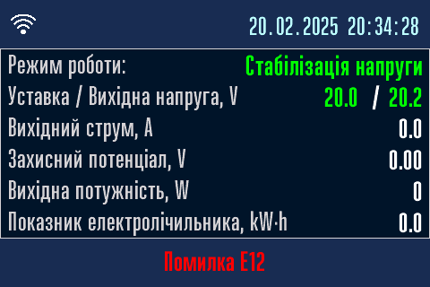
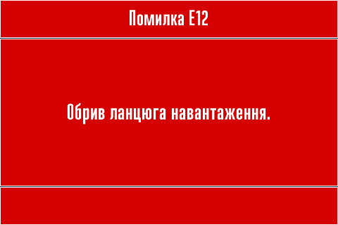
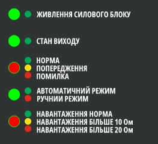

# Попередження та помилки перетворювача { #errors data-toc-label='Помилки та попередження' }

У випадку сбоїв в роботі буде показано номер попередження або помилки в нижному блоці інформаційних сторінок. 

Сторінка з описом попередження або помилки показується протягом 6 секунд після інформаційних сторінок.   
Й далі по колу. Інформація оновлюється в режимі реального часу.  

При цьому індикатор НОРМА ПОПЕРЕДЖЕННЯ ПОМИЛКА буде світитися відповідним кольором.

Таблиця з описом попередженнь.

| **Номер попередження** | **Детальний опис попередження** |
|---|---|
| W1 | Увага! Температура силового блоку понад 80°C. |
| W2 | Увага! Невірна дата. Встановіть коректну дату та час. |

Таблиця з описом помилок.

| **Номер помилки** | **Детальний опис помилки** |
|---|---|
| E1 | Живлення від мережі відсутнє. |
| E2 | Напруга живлення менше 100V. | 
| E3 | Немає зв'язку з силовим блоком або він відключений. | 
| E4 | Спрацював захист від перенапруги. | 
| E5 | Спрацював захист від перевантаження. | 
| E6 | Спрацював захист від перегріву, внутрішня температура перевищує 90°C. | 
| E7 | Спрацював захист, несправність вентилятора. | 
| E8 | Системна помилка силового блоку. | 
| E9 | Помилка зв'язку з силовим блоком.  Силовий блок знаходиться в незапланованому режимі очікування. | 
| E10 | Помилка зв'язку з силовим блоком.  Силовий блок знаходиться в незапланованому локальному режимі. | 
| E11 | Помилка зв'язку з силовим блоком.  Некоретна команда. | 
| E12 | Обрив ланцюга навантаження. | 
| E13 | Схема вимірювання захисного потенціалу не працює. | 
| E14 | Захисний потенціал знаходиться поза межами діапазонуу -10V ... +5V. | 
| E15 | Немає зв'язку з дисплеєм. |
