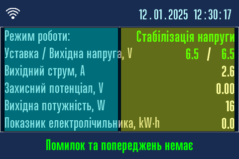

# Ручне керування перетворювачем { #manual-interface data-toc-label='Ручне керування' }

Найкращим засобом локального керування перетворювачем є варіант за допомогою [Веб-интерфейсу.](../web-interface)   
Однак, якщо у вас немає під рукою смартфона/планшета/ноутбука або його батарея розряджена, локальне ручне керування за допомогою кнопок вибору типу стабілізації, ручки енкодера та дисплея є єдиним варіантом керування.

**Зовнішній вигляд панелі індикації та керування.**   

{ width="250" }  

Для збільшення натисніть на зображенні.

## Кнопки, ручка енкодера та дисплей { #manual-interface-dysplay data-toc-label='Чим керувати?' }

Перетворювач має чотири кнопки для зміни типу стабілізації або вимкнення виходу та міні-зумер для сигналізації про натиснення кнопок. За допомогою кнопок можливо виконати дві дії:

| Команда для кнопок | Детальний опис, як виконати команду |
|---|---|
| Коротке натискання кнопки :material-clock-time-one: | Коротко натиснути на кнопку й зразу відпустити, при цьому лунає дуже короткий звуковий сигнал |
| Довге натискання кнопки :material-clock-time-ten: | Довго, більш ніж на дві секунди, натиснути на кнопку й відпустити після довгого, пів-секундного, звукового сигналу |

Основним органом керування перетворювачем є ручка енкодера. В перетворювачі встановлено електромеханічний енкодер з кнопкою. За допомогою ручки енкодера можливо виконати п'ять дій:

| Команда для енкодера | Детальний опис, як виконати команду |
|---|---|
| Поворот праворуч :material-rotate-right: | Повернути ручку енкодера праворуч, при цьому лунає дуже короткий звуковий сигнал |
| Поворот ліворуч :material-rotate-left: | Повернути ручку енкодера ліворуч, при цьому лунає дуже короткий звуковий сигнал |
| Коротке натискання ручки :material-clock-time-one-outline: | Коротко натиснути на ручку енкодера й зразу відпустити, при цьому лунає дуже короткий звуковий сигнал |
| Подвійне натискання ручки  :material-clock-time-one-outline:  :material-clock-time-one-outline: | Коротко натиснути на ручку й зразу відпустити потім негайно знову коротко натиснути на ручку й зразу відпустити при цьому лунає короткий звуковий сигнал |
| Довге натискання ручки :material-clock-time-ten-outline: | Довго, більш ніж на дві секунди, натиснути на ручку енкодера й відпустити після довгого, пів-секундного, звукового сигналу |

Перетворювач має вбудований 3,5 дюймовий кольоровий сенсорний TFT LCD дисплей з екраном розміром 73x50 мм. Він зображує режим роботи та поточні параметри перетворювача. Крім того, можна використовувати сенсорний екран для керування. 

## Використання сенсорного екрана дисплея { #manual-interface-sensor data-toc-label='Сенсорний екран' }

Всі сторінки дисплея, окрім стартової з логотипом, мають однакову структуру.

- Верхній блок інформаційних сторінок використовується для показу анімованого значка Wi-Fi й дати та часу.  
  Верхній блок у всіх інших сторінок використовується для назви сторінки. 
- Далі основний блок, він займає близько 70% висоти сторінки. В ньому розміщується інформація, меню тощо. 
  Основний блок має дві сенсорні зони.   
  Ліва блакитна зона, надалі по тексту ця зона буде називатися *лівою сенсорною зоною*.   
  Права жовта зона, надалі по тексту ця зона буде називатися *правою сенсорною зоною*.  
- Нижній блок сторінки використовується для повідомлень або підказок.

!!! info "Як працювати з сенсорним екраном."
    Команда для сенсорного екрану спрацьовує після натискання з подальшим відпусканням стилуса. На натиск екран не буде реагувати, тілки на натиск з подальшим звільненням стилуса від екрана.

!!! warning "Зверніть увагу!"
    Не використовуйте гострі та дуже тверді предмети в якості стилуса для сенсорного екрана. Рекомендується натискати на екран чимось м'яким. Це може бути, наприклад, палець, дерев'яна паличка або олівець з гумкою, і натискати не олівцем, а гумкою. Як інший варіант можна надіти на кулькову ручку силіконовий наконечник.

## Режим роботи та сну дисплея { #manual-interface-sleep data-toc-label='Режими роботи дисплея' }

Дисплей майже весь час спить. Екран при цьому темний та ніякі дані дисплей не отримує. Він прокидається лише тоді, коли відкриваються дверцята шафи перетворювача. Він почне отримувати дані та показувати їх на екрані. Після закриття дверцят шафи він знову засинає.

## Режими роботи перетворювача { #manual-interface-modes data-toc-label='Режими роботи перетворювача' }

Перетворювач може працювати в 4 режимах роботи:

- Режим стабілізації напруги, має зелений світлодіодний індикатор та зелену кнопку.
- Режим стабілізації струму, має жовтий світлодіодний індикатор та жовту кнопку.
- Режим стабілізації потенціалу, має синій світлодіодний індикатор та синю кнопку.
- Вихід вимкнутий, режим очікування, має червоний світлодіодний індикатор та червону або чорну кнопку.

## Стартова сторінка з логотипом { #manual-interface-logo data-toc-label='Стартова сторінка' }

Після ввімкнення живлення на дисплеї з'явиться логотип ТОВ "Технотек" та назва моделі перетворювача. Одночасно з цим дисплей починає отримувати від модуля управління поточні дані про стан перетворювача. 

Через декілька секунд відкриється головна сторінка.

!!! note "Команд для цієї сторінки немає."
    Команди на цій сторінці не працюють.  
    Сенсорних зон на цій сторінці немає.  

## Iнформаційні сторінки { #manual-interface-info data-toc-label='Головна сторінка' }

Дисплей показує дві інформаційні сторінки.   
Перша інформаційна сторінка є головною сторінкою в перетворювачі, вона показується протягом 12 секунд.

Друга інформаційна сторінка є додатковою й показується протягом 6 секунд. 

Якщо є помилки або попередження, то [сторінка з описом попередження або помилки]( ../errors ) показується протягом 6 секунд.   
Й далі по колу. Інформація оновлюється в режимі реального часу.

!!! note "Команди для цих сторінок."
    - Довге натискання кнопок :material-clock-time-ten:  перехід до [обраного режиму роботи]( #manual-interface-mode-button ).
    - Коротке натискання ручки :material-clock-time-one-outline: негайний, без тайм-аута, перехід до іншої інформаційної сторінки.
    - Подвійне натискання ручки :material-clock-time-one-outline: :material-clock-time-one-outline: перехід до [вибору режиму роботи]( #manual-interface-mode).
    - Ліва сенсорна зона: перехід до [вибору режиму роботи]( #manual-interface-mode).
    - Довге натискання ручки :material-clock-time-ten-outline: та права сенсорна зона: перехід до [меню налаштувань](#manual-interface-settings).

## Встановлення режиму роботи перетворювача { #manual-interface-mode data-toc-label='Встановлення режиму роботи ' }

Є три способи встановити режим роботи перетворювача:

- Кнопками.
- Ручкою енкодера.
- Сенсорним дисплеєм.

### Встановлення режиму роботи перетворювача кнопками { #manual-interface-mode-button data-toc-label='Кнопками' }

Швидко та зручно встановити режим роботи перетворювача можна за домогою кнопок.

- [x] Перейдіть в РУЧНИЙ РЕЖИМ. Для цього довго, більш ніж на дві секунди, треба натиснути на кнопку потрібного режиму роботи :material-clock-time-ten: й відпустити після довгого, пів-секундного, звукового сигналу.
- [x] Світлодіодний індикатор обраного режиму почне блимати раз на секунду.
- [x] Поворотом ручки енкодера праворуч :material-rotate-right: та/або ліворуч :material-rotate-left: встановити необхідне значення уставки напруги, струму або потенціалу.
- [x] Після налаштування коротко натисніть на відповідну кнопку :material-clock-time-one: або зачекайте 20 секунд для переходу в АВТОМАТИЧНИЙ РЕЖИМ.   

Змінити режим роботи перетворювача можна також за допомогою ручки або сенсорного дисплея. 

### Встановлення режиму роботи ручкою або сенсорним дисплеєм { #manual-interface-mode-sensor data-toc-label='Ручкою або сенсорним дисплеєм' }

Для переходу в РУЧНИЙ РЕЖИМ натисніть на ліву сенсорну зону або використайте подвійне натискання :material-clock-time-one-outline: :material-clock-time-one-outline: ручки.

- [x] Перетворювач перейде в РУЧНИЙ РЕЖИМ та на дисплеї з'явиться меню вибору типа стабілізації.
- [x] Перейдіть в потрібний пункт меню (1) поворотом ручки праворуч :material-rotate-right: або ліворуч :material-rotate-left:.
- [x] Виберіть його коротким натисканням ручки :material-clock-time-one-outline:.
- [x] Якщо команда виконалася без помилок, то з'явиться (2) підтвердження про успіх. 
- [x] Автоматично відкриється (3) головна сторінка та світлодіодний індикатор обраного режиму почне блимати раз на секунду.
- [x] Поворотом ручки праворуч :material-rotate-right: та ліворуч :material-rotate-left: встановіть необхідне значення уставки напруги, струму або потенціалу.
- [x] Після налаштування коротко натисніть на відповідну кнопку :material-clock-time-one: або зачекайте 20 секунд для переходу в АВТОМАТИЧНИЙ РЕЖИМ.   

1.  
2. 
3. 

!!! note "Команди для цієї сторінки."
    - Поворот праворуч :material-rotate-right: та ліворуч :material-rotate-left: вибір режиму роботи.
    - Коротке натискання :material-clock-time-one-outline: перехід до обраного режиму роботи.
    - Подвійне :material-clock-time-one-outline: :material-clock-time-one-outline: та довге натискання :material-clock-time-ten-outline: та ліва або права сенсорна зона - повернутися до головної сторінки.

***Коротке [відео](./nex-mode-video.md) нелалаштування режиму роботи.***

!!! info "Якщо оператор не здійснює жодних команд на протязі 20 секунд, то виконується автоматичний перехід до головної сторінки."
    

## Меню налаштувань перетворювача { #manual-interface-settings data-toc-label='Меню налаштувань' }

!!! note "Команди для цієї сторінки."
    - Поворот праворуч :material-rotate-right: та ліворуч :material-rotate-left: перехід по пунктах меню.
    - Коротке натискання :material-clock-time-one-outline: ручки: перехід до обраного пункта меню.
    - Подвійне або довге натискання :material-clock-time-ten-outline: ручки та ліва або права сенсорна зона: повернутися до головної сторінки.

!!! info "Якщо оператор не здійснює жодних команд на протязі 20 секунд, то виконується автоматичний перехід до головної сторінки."
    
### Обмеження вихідного струму та напруги при аварії { #manual-settings-limits data-toc-label='Обмеження струму та напруги' }

- В пункті *Струм при обриві електрода* обмежується максмимальний струм при обриві мідносульфатного електрода порівняння.
- В пункті *Напруга при обриві навантаження* обмежується максмимальна напруга при обриві ланцюгів навантаження.
- В пункті *Затримка при зміні режиму* задається затримка в секундах перед зміною режиму роботи при аваріях.
- Заводське значення 5.0A, 5.0V та 60 секунд відповідно.  

- [x] Для зміни обмеженнь та затримки потрібно клацнути на відповідному пункті меню та ввести нове значення й підтвердити *ОК*.

!!! note "Команди для цієї сторінки."
    - Поворот праворуч :material-rotate-right: та ліворуч :material-rotate-left: перехід по пунктах меню.
    - Коротке натискання ручки :material-clock-time-one-outline: зміна відповідного параметра.
    - Подвійне або довге натискання ручки :material-clock-time-ten-outline: та ліва або права сенсорна зона: повернутися до головної сторінки.

***Коротке [відео](./nex-limits-video.md) налаштування обмежень при аварії.***

!!! info "Якщо оператор не здійснює жодних команд на протязі 20 секунд, то виконується автоматичний перехід до головної інформаційної сторінки."
    

### Налаштування ПІД регулятора { #manual-settings-pid data-toc-label='ПІД регулятор' }

ПІД регулятор стабілізує потенціал в режимі стабілізації потенціалу. Параметрами ПІД регулятора є три коефіцієнти: пропорційний, інтегральний та диференціальний. Ці коефіцієнти відповідають за швидкість стабілізації, стабільність та точність підтримання потенціалу згідно уставки. 

Існує два режими роботи ПІД регулятора: стандартний та ручний режим.

В стандартному режимі коефіцієнти задані виробником: 

- Пропорційний та інтегральний коефіцієнти дорівнюють 1.0.
- Диференціальний коефіцієнт дорівнює 0.3.

!!! note "Команди для цієї сторінки."
    - Поворот праворуч :material-rotate-right: та ліворуч :material-rotate-left: перехід по пунктах меню.
    - Коротке натискання ручки :material-clock-time-one-outline: зміна режиму роботи ПІД регулятора.
    - Подвійне натискання ручки :material-clock-time-one-outline: :material-clock-time-one-outline: або ліва сенсорна зона: повернутися до меню налаштувань.
    - Довге натискання ручки :material-clock-time-ten-outline: або права сенсорна зона: повернутися до головної інформаційної сторінки.

!!! info "Якщо оператор не здійснює жодних команд на протязі 20 секунд, то виконується автоматичний перехід на сторінку меню налаштувань."

В ручному режимі є можливість змінити коефіцієнти, якщо швидкість стабілізації або стабільність чи точність підтримання потенціалу згідно уставки незадовільна. Таке може статися при умовах нестандартної інерційності кола навантаження. У випадку вибору ручного режиму відкриється сторінка налаштуваннь коефіциєнтів ПІД регулятора.  

!!! note "Команди для цієї сторінки."
    - Поворот праворуч :material-rotate-right: та ліворуч :material-rotate-left: перехід по пунктах меню.
    - Коротке натискання ручки :material-clock-time-one-outline: зміна відповідного параметра.
    - Подвійне натискання ручки :material-clock-time-one-outline: :material-clock-time-one-outline: або ліва сенсорна зона: перехід на сторінку налаштування ПІД регулятора.
    - Довге натискання ручки :material-clock-time-ten-outline: або права сенсорна зона: повернутися до меню налаштувань.

***Коротке [відео](./nex-pid-video.md) налаштування коефіцієнтів для ручного режиму ПІД регулятора.***

!!! info "Якщо оператор не здійснює жодних команд на протязі 20 секунд, то виконується автоматичний перехід на сторінку налаштування ПІД регулятора."
    

### Налаштування електролічильника { #manual-settings-meter data-toc-label='Eлектролічильник' }

- В пункті *Показник лічильника* вводиться поточний показник лічильника.
- В пункті *Імпульсів за kW⋅h* вводиться кількість імпульсів, які виробляє лічильник електроенергії перетворювача за одну kW⋅h.   
  Цей параметр вказується в паспорті на встановлений лічильник електроенергії. Заводське значення 6400 для встановленного лічильника.  

- [x] Для зміни налаштувань лічильника потрібно клацнути на поточне значення параметра та ввести нове значення й підтвердити кнопкою *ОК*.

!!! note "Команди для цієї сторінки."
    - Поворот праворуч :material-rotate-right: та ліворуч :material-rotate-left: перехід по пунктах меню.
    - Коротке натискання ручки :material-clock-time-one-outline: зміна відповідного параметра.
    - Подвійне натискання ручки :material-clock-time-one-outline: :material-clock-time-one-outline: або ліва сенсорна зона: повернутися до меню налаштувань.
    - Довге натискання ручки :material-clock-time-ten-outline: або права сенсорна зона: повернутися до головної інформаційної сторінки.

***Коротке [відео](./nex-meter-video.md) налаштування електролічильника.***

!!! info "Якщо оператор не здійснює жодних команд на протязі 20 секунд, то виконується автоматичний перехід до меню налаштувань."
    

### Меню системних налаштуваннь { #manual-settings-system data-toc-label='Системні налаштування' }

- В пункті *Налаштування дати та часу* встановлюється дата та час перетворювача.
- В пункті *Вибір мови* встановлюється мова інтерфейсу перетворювача.

!!! note "Команди для цієї сторінки."
    - Поворот праворуч :material-rotate-right: та ліворуч :material-rotate-left: перехід по пунктах меню.
    - Коротке натискання :material-clock-time-one-outline: ручки: перехід до обраного пункта меню.
    - Подвійне натискання ручки :material-clock-time-one-outline: :material-clock-time-one-outline: або ліва сенсорна зона: повернутися до меню налаштувань.
    - Довге натискання ручки :material-clock-time-ten-outline: або права сенсорна зона: повернутися до головної інформаційної сторінки.

!!! info "Якщо оператор не здійснює жодних команд на протязі 20 секунд, то виконується автоматичний перехід до головної інформаційної сторінки."
    

#### Налаштування дати та часу { #manual-settings-system-date data-toc-label='Дата та час' }

!!! note "Команди для цієї сторінки."
    - Поворот праворуч :material-rotate-right: та ліворуч :material-rotate-left: : перехід по пунктах та/або збільшення/зменшення дати та часу. 
    - Коротке натискання :material-clock-time-one-outline: ручки: перехід до обраного пункта та/або ввійти/вийти з режиму збільшення/зменшення дати та часу.
    - Подвійне натискання ручки :material-clock-time-one-outline: :material-clock-time-one-outline: або ліва сенсорна зона: повернутися до меню налаштувань.
    - Довге натискання ручки :material-clock-time-ten-outline: або права сенсорна зона: повернутися до головної інформаційної сторінки.

***Коротке [відео](./nex-date-video.md) налаштування дати та часу.***

!!! info "Якщо оператор не здійснює жодних команд на протязі 20 секунд, то виконується автоматичний перехід до системних налаштуваннь."
    

#### Вибір мови інтерфейсу { #manual-settings-system-lang data-toc-label='Мова інтерфейсу' }

!!! note "Команди для цієї сторінки."
    - Поворот праворуч :material-rotate-right: та ліворуч :material-rotate-left: перехід по пунктах меню. 
    - Коротке натискання :material-clock-time-one-outline: ручки: вибір мови інтерфейсу.
    - Подвійне натискання ручки :material-clock-time-one-outline: :material-clock-time-one-outline: або ліва сенсорна зона: повернутися до меню налаштувань.
    - Довге натискання ручки :material-clock-time-ten-outline: або права сенсорна зона: повернутися до головної інформаційної сторінки.

***Коротке [відео](./nex-lang-video.md) налаштування мови інтерфейсу.***

!!! info "Якщо оператор не здійснює жодних команд на протязі 20 секунд, то виконується автоматичний перехід до меню налаштувань."
    
### Інформація про перетворювач { #manual-settings-about data-toc-label='Про перетворювач' }

Інформація про перетворювач розташована на двох сторінках: основні дані та додаткові дані. Основні дані показуються протягом 6 секунд.

Додаткові дані показуються також протягом 6 секунд. 

Далі перехід до головної інформаційної сторінки.

!!! note "Команди для цієї сторінки."
    - Коротке натискання :material-clock-time-one-outline: ручки або права сенсорна зона: негайний перехід між сторінками основних та додаткових даних.
    - Подвійне натискання ручки :material-clock-time-one-outline: :material-clock-time-one-outline: та довге натискання ручки :material-clock-time-ten-outline: або ліва сенсорна зона: повернутися до головної інформаційної сторінки.

