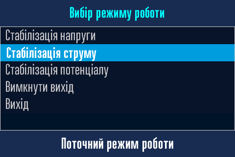

# Ручне керування перетворювачем { #manual-interface data-toc-label='Ручне керування' }

<h1>Увага! Сторінка в процесі наповнення!</h1>

Найкращим засобом локального керування перетворювачем є варіант за допомогою [Веб-интерфейсу.](../web-interface)   
Однак, якщо у вас немає під рукою смартфона/планшета/ноутбука або його батарея розряджена, локальне ручне керування за допомогою ручки енкодера, міні-зумера та дисплея є єдиним варіантом керування.

## Дисплей, міні-зумер та ручка енкодера { #manual-interface-dysplay data-toc-label='Чим керувати?' }

Перетворювач має вбудований 3,5 дюймовий кольоровий сенсорний TFT LCD дисплей з екраном розміром 73x50 мм. Він зображує поточні параметри перетворювача та їхню зміну при керуванні. Крім того, можна, як додаткову можливість, використовувати сенсорний екран для керування. 

Перетворювач має вбудований міні-зумер. Він допомагає при керуванні перетворювачем сигналізуючи звуковим сигналом про стан керування.

Основним органом керування перетворювачем є ручка енкодера. В перетворювачі встановлено електромеханічний енкодер з кнопкою. На осі енкодера закріплена ручка, яка і є тим органом управління, що використовується оператором.

За допомогою ручки енкодера можливо виконати три дії:

- [x] Повернути ручку енкодера праворуч.
- [x] Повернути ручку енкодера ліворуч.
- [x] Натиснути на ручку енкодера.

Всі дії при цьому супроводжуються звуковим сигналом міні-зумера. Але цього недостатньо для повноцінного керування, тому були введені деякі особливості натискання ручки, які супроводжуються різним звуковим сигналом.

## Комбінації дій ручки енкодера та зумера { #manual-interface-combination data-toc-label='Як керувати?' }

В тексті далі буде використовуваться наступна лексика та піктограми для команд, які можливі через такі комбінації:

| Команда коротко | Детальний опис, як виконати команду |
|---|---|
| Поворот праворуч :material-rotate-right: | Повернути ручку енкодера праворуч, при цьому лунає дуже короткий звуковий сигнал |
| Поворот ліворуч :material-rotate-left: | Повернути ручку енкодера ліворуч, при цьому лунає дуже короткий звуковий сигнал |
| Коротке натискання :material-clock-time-one-outline: | Коротко натиснути на ручку енкодера й зразу відпустити, при цьому лунає дуже короткий звуковий сигнал |
| Довге натискання :material-clock-time-three-outline: | Довго, більш ніж на пів-секунди, натиснути на ручку енкодера й відпустити після довгого, пів-секундного, звукового сигналу |
| Дуже довге натискання :material-clock-time-ten-outline: | Дуже довго, більш ніж на дві секунди, натиснути на ручку енкодера й  відпустити після двох звукових сигналів, спочатку довгого, пів-секундного,  й потім дуже довгого, півтора-секундного, звукового сигналу |

Звучить складно, але на практиці все просто, потрібно лише спробувати.

## Використання сенсорного екрана дисплея { #manual-interface-sensor data-toc-label='Сенсорний екран' }

Всі сторінки дисплея, окрім стартової з логотипом, мають однакову структуру.

- Верхній блок інформаційних сторінок використовується для показу анімованого значка Wi-Fi, стану акумулятора й дати та часу.  
  Верхній блок у всіх інших сторінок використовується для назви сторінки. 
- Далі основний блок, він займає близько 70% висоти сторінки. В ньому розміщується інформація, меню тощо. 
  Основний блок має дві сенсорні зони.   
    * Ліва блакитна зона, надалі по тексту ця зона буде називатися ==*лівою сенсорною зоною*==.   
    * Права жовта зона, надалі по тексту ця зона буде називатися ==*правою сенсорною зоною*==.  
- Нижній блок сторінки використовується для повідомлень або підказок.

!!! info "Як працювати з сенсорним екраном."
    Команда для сенсорного екрану спрацьовує після натискання з подальшим відпусканням стилуса. На натиск екран не буде реагувати, тілки на натиск з подальшим звільненням стилуса від екрана.

!!! warning "Зверніть увагу!"
    Не використовуйте гострі та дуже тверді предмети в якості стилуса для сенсорного екрана. Рекомендується натискати на екран чимось м'яким. Це може бути, наприклад, дерев'яна паличка або олівець з гумкою, і натискати не олівцем, а гумкою. Як інший варіант можна надіти на кулькову ручку силіконовий наконечник.

## Режим роботи та сну дисплея { #manual-interface-sleep data-toc-label='Режим роботи та сну' }

Дисплей майже весь час спить. Екран при цьому темний та ніякі дані дисплей не отримує. Він прокидається лише тоді, коли відкриваються дверцята шафи перетворювача. Він почне отримувати дані та показувати їх на екрані. Після закриття дверцят шафи він знову засинає.

## Стартова сторінка з логотипом { #manual-interface-logo data-toc-label='Стартова сторінка' }

Після ввімкнення живлення на дисплеї з'явиться логотип ТОВ "Технотек" та назва моделі перетворювача. Одночасно з цим дисплей починає отримувати від модуля управління поточні дані про стан перетворювача. 

Через декілька секунд відкриється головна сторінка.

!!! note "Команд для цієї сторінки немає."
    Команди ручки енкодера на цій сторінці не працюють.
    Сенсорних зон на цій сторінці немає.

## Iнформаційні сторінки { #manual-interface-info data-toc-label='Головна сторінка' }

Є дві інформаційні сторінки.   
Перша сторінка є головною сторінкою в перетворювачі, вона показується протягом 12 секунд.

Друга сторінка показується протягом 6 секунд. 

Й далі по колу. Інформація оновлюється в режимі реального часу.

!!! note "Команди для цих сторінок."
    - Повороти праворуч :material-rotate-right: та ліворуч :material-rotate-left: не працюють.
    - Коротке натискання :material-clock-time-one-outline: - негайний, без тайм-аута, перехід до іншої інформаційної сторінки.
    - Довге натискання :material-clock-time-three-outline: та ліва сенсорна зона - перехід до [вибору режиму роботи]( #manual-interface-mode).
    - Дуже довге натискання :material-clock-time-ten-outline: та права сенсорна зона - перехід до [меню налаштувань](#manual-interface-mode).

## Вибір режиму роботи перетворювача { #manual-interface-mode data-toc-label='Вибір режиму роботи' }

!!! note "Команди для цієї сторінки."
    - Поворот праворуч :material-rotate-right: та ліворуч :material-rotate-left: перехід по пунктах меню.
    - Коротке натискання :material-clock-time-one-outline: - перехід до обраного режиму роботи.
    - Довге натискання :material-clock-time-three-outline: та ліва сенсорна зона - повернутися до головної сторінки.
    - Дуже довге натискання :material-clock-time-ten-outline: та права сенсорна зона - повернутися до головної сторінки.

- [x] Перейдіть в потрібний пункт меню (1) поворотом ручки праворуч :material-rotate-right: або ліворуч :material-rotate-left:.
- [x] Виберіть його коротким натисканням ручки :material-clock-time-one-outline:.
- [x] Якщо команда виконалася без помилок, то з'явиться (2) підтвердження про успіх. 
- [x] Автоматично відкриється (3) головна сторінка.    

1.  
2. 
3. 

!!! info "Автоматичний перехід при бездіяльності"
    Якщо оператор не здійснює жодних команд, то виконується автоматичний перехід до головної сторінки через 20 секунд бездіяльності.

## Меню налаштувань перетворювача { #manual-interface-mode data-toc-label='Меню налаштувань' }

!!! note "Команди для цієї сторінки."
    - Поворот праворуч :material-rotate-right: та ліворуч :material-rotate-left: перехід по пунктах меню.
    - Коротке натискання :material-clock-time-one-outline: - перехід до обраного пункта меню.
    - Довге натискання :material-clock-time-three-outline: та ліва сенсорна зона - повернутися до головної сторінки.
    - Дуже довге натискання :material-clock-time-ten-outline: та права сенсорна зона - повернутися до головної сторінки.

!!! info "Автоматичний перехід при бездіяльності"
    Якщо оператор не здійснює жодних команд, то виконується автоматичний перехід до головної сторінки через 20 секунд бездіяльності.

### Обмеження вихідного струму та напруги при аварії { #manual-settings-limits data-toc-label='Обмеження струму та напруги' }

!!! note "Команди для цієї сторінки."
    - Поворот праворуч :material-rotate-right: та ліворуч :material-rotate-left: перехід по пунктах меню.
    - Коротке натискання :material-clock-time-one-outline: - перехід до обраного пункта меню.
    - Довге натискання :material-clock-time-three-outline: та ліва сенсорна зона - повернутися до головної сторінки.
    - Дуже довге натискання :material-clock-time-ten-outline: та права сенсорна зона - повернутися до головної сторінки.

!!! info "Автоматичний перехід при бездіяльності"
    Якщо оператор не здійснює жодних команд, то виконується автоматичний перехід до головної сторінки через 20 секунд бездіяльності.

## Помилки та попередження перетворювача { #manual-interface-error data-toc-label='Помилки та попередження' }

