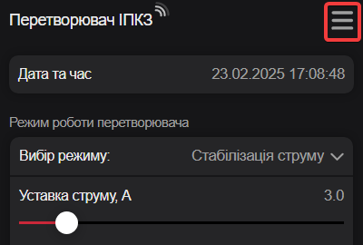

# Оновлення { #upgrade data-toc-label='Оновлення' }

Цей сайт для ІПКЗ апаратної версії 1.0.   
Будьте уважні перед оновленням, перевірте свою апаратну версію!   
Для перевірки  апаратної версії потрібно зайти на сторінку [*Про перетворювач*](../web-interface/#go-about) й перевірити пункт *Версія апаратного забезпечення*.

## Порядок оновлення прошивки перетворювача { #upgrade-ipkz data-toc-label='Оновлення перетворювача' }

Прошивка перетворювача має формат `ipkz_update_a_b.bin`, де `a` та `b` це версія.   
Наприклад, `ipkz_update_1_4.bin` це оновлення програмної версії до версії `1.4`.

- [x] Завантажити останню прошивку перетворювача [ipkz_update_1_4.bin](./assets/files/ipkz_update_1_4.bin) в свій ноутбук.
- [x] Зайти в системне меню (1) Веб-інтерфейсу, клацнувши піктограму :material-menu:.
- [x] Клацнути на піктограмі :material-cloud-upload: й вибрати (2) файл прошивки.
- [x] Після успішного завершення процесу оновлення перетворювач перезавантажиться.
- [x] Для перевірки оновленої версії програмного забезпечення потрібно зайти на сторінку [*Про перетворювач*](../web-interface/#go-about) й перевірити пункт *Версія програмного забезпечення*.

1. 
2. 

!!! warning "Зверніть увагу!"
    Оновлення прошивки працює не на всіх смартфонах, краще використовуйте ноутбук.

## Порядок оновлення прошивки дисплея { #upgrade-display data-toc-label='Оновлення дисплея' }

Прошивка дисплею має формат `display_ipkz_update_a_b.tft`, де `a` та `b` це версія.   
Наприклад, `display_ipkz_update_1_4.tft` це оновлення програмної версії до версії `1.4`.

- [x] Завантажити останню прошивку дисплея  [display_ipkz_update_1_4.tft](./assets/files/display_ipkz_update_1_4.tft) в свій ноутбук.
- [x] Відформатувати SD карту в форматі FAT32.
- [x] Скопіювати прошивку дисплея в SD карту.
- [x] Відключити живлення, вставити SD карту в дисплей та включити живлення.
- [x] Процес оновлення прошивки буде видно на дисплеї.
- [x] Після закінчення оновлення прошивки відключити живлення, вийняти SD карту з дисплею та включити живлення.
