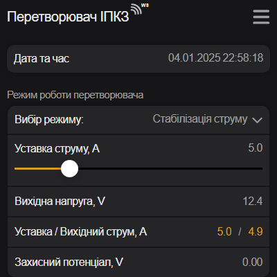
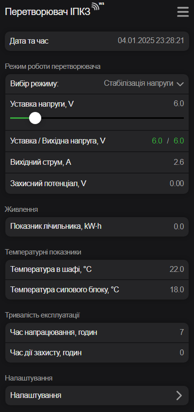

# Веб-інтерфейс перетворювача { #web-interface data-toc-label='Веб-інтерфейс' }
Веб-інтерфейс - це сукупність засобів, за допомогою яких користувач може керувати перетворювачем.

- Доступ з будь-якого пристрою, наприклад, ноутбука, планшета або смартфона.
- Немає прив'язки до конкретного обладнання або операційної системи.
- Простота і зручність у використанні.

## Підключення та відключення { #connect data-toc-label='Підключення' }

Можна використовувати телефон, смартфон , планшет, ноутбук і т.п.  
Взагалі любий електронний прилад, де є модуль Wi-Fi та браузер *Google Chrome*, *Safari*, *Mozilla Firefox*, *Opera*, *Edge* або інший.

- [x] Відкрийте дверцята шафи перетворювача.
- [x] В перетворювачі почне працювати Wi-Fi точка доступу з назвою `IPKZ-XXXXXX`.  
   Де `XXXXXX` - це унікальна послідовність цифр від 0 до 9 та латинських букв від A до F.   
   Для прикладу, назва точки доступу `IPKZ-F2B1D4`.
- [x] Потрібно під'єднатися до цієї Wi-Fi мережі `IPKZ-F2B1D4`. Мережа відкрита й пароль вводити не потрібно.    
- [x] Автоматично запуститься браузер й відкриється Веб-інтерфейс перетворювача.
- [x] Wi-Fi точка доступу перетворювача перестане працювати після закриття дверцят шафи.

!!! warning "Зверніть увагу!"
    - З міркувань безпеки до перетворювача дозволяється підключення тільки **==одного==** електронного приладу.    
    - Інший телефон, планшет або ноутбук при спробі з'єднання буде проігнорований!   
    - Для під'єднання іншого приладу, потрібно в попередньо підключеному приладі відключити Wi-Fi, або зайти в налаштування мережі та вибрати пункт **==Забути==** про цю мережу.    

!!! tip "Відкриття Веб-інтерфейсу по IP адресі"
    Якщо з будь-яких причин не працює або не влаштовує автоматичне відкриття бразуера після під'єднання до точки доступу перетворювача, то є можливість відкриття Веб-інтерфейсу вручну. 

    - Під'єднайтеся до точки доступу перетворювача, її назва починається з `IPKZ-`.
    - Відкрийте улюблений браузер.
    - В адресному рядку браузера наберіть адресу 8.8.8.8 й перейдіть на цю адресу.   

## Контроль якості зв'язку { #comm-control data-toc-label="Якість зв'язку" }

Перетворювач контролює якість Wi-Fi зв'язку між ним та підключеним пристроєм.   
Після назви сторінки є піктограма , яка показує реальну якість зв'язку.

- Відмінна якість зв'язку 
- Середня якість зв'язку 
- Погана якість зв'язку 
- З'єднання втрачено 

Насправді якість з'язку повинна бути відмінна завжди, тому що оператор знаходиться в метрі або декількох метрах від перетворювача. 

!!! note "Якщо є підозра, що сторінка зависла"
    Потрібно оновити або перезавантажити Веб-інтерфейс засобами браузера.   
    В Windows та Linux оновити сторінку можна через пункт меню :material-refresh: або клавішу ++f5++ або ++ctrl+r++.    
    Для повного перезавантаження Веб-інтерфейсу використовуйте комбінацію клавіш ++ctrl+f5++ або ++shift+f5++ або ++ctrl+shift+r++.     
    В Android та iOS через пункт меню :material-refresh: або свайпом :material-gesture-swipe-down: з середини екрану донизу.   

    Як альтернативний варіант - відключитись від точки доступу й підключитись до неї знову. 

## Вибір теми інтерфейсу { #select-theme data-toc-label='Вибір теми' }
Можна вибрати темну або світлу тему інтерфейсу.

=== "Скріншот світлої теми"  
    

=== "Скріншот темнної теми"
    

- [x] Для зміни теми потрібно зайти в системне меню (1) клацнувши :material-menu: 
- [x] Клацнути на піктограмму напівмісяця :fontawesome-solid-moon: для переключення теми (2)
- [x] Клацнути :material-window-close: для виходу з системного меню (3)

1.  
2.  
3.  

***Коротке [відео](./theme-video.md) зміни режиму роботи.***

## Головна сторінка { #main-page data-toc-label='Головна сторінка' }

=== "Опис головної сторінки"

    На головній сторінці розміщені основні дані перетворювача:   

    - Дата та час перетворювача.   
    - Поточний режим роботи та вихідні параметри.     
    - Показники живлення.   
    - Температурні показники.    
    - Тривалість експлуатації. 

    Тут також є декілька пунктів меню:  

    - [Зміна режиму роботи.](#select-mode)
    - [Встановлення дати та часу](#setting-datetime)
    - [Перехід на сторінку *Налаштування*.](#go-settings)    

=== "Скріншот головної сторінки"

    Для збільшення натисніть на зображенні.

    { width="250" }  

### Зміна режиму роботи { #select-mode data-toc-label='Зміна режиму' }

- [x] Для відключення виходу або переходу в режим стабілізації напруги, струму чи потенціалу в пункті *Вибір режиму* (1) потрібно клацнути :fontawesome-solid-angle-down:.
- [x] Далі клацніть на потрібний режим роботи (2) у меню, що з'явилося. 
- [x] З'явиться повзунок (слайдер), в якому треба встановити значення уставки.   
1. Перший спосіб. Потягнути повзунок вліво або вправо (3)  при цьому контролюючи новий показник повзунка.  
2. Другий спосіб. Клацнути на показник повзунка (4) та ввести нове значення й підтвердити кнопкою *ОК* (5)  

1.  
2.  
3.  
4.  
5.  

***Коротке [відео](./mode-video.md) зміни режиму роботи.***

!!! warning "Зверніть увагу!"
    При введенні числа використовуйте ==крапку==, як десятковий роздільник.  
    Допустимий діапазон значення уставки cтруму залежить від моделі перетворювача (номінальної потужності).   
    При введенні значення поза діапазоном - це значення буде автоматично змінено до допустимоі межи.

    | **Модель** | **Допустимий діапазон струму для уставки, A** | **Допустимий діапазон напруги для уставки, V** | **Допустимий діапазон потенціалу для уставки, V** |   
    |---|---|---|---|   
    | ІПКЗ-600-50 | Від 0 до 13.0 | Від 0 до 51.0 | Від -5.00 до 0 |   
    | ІПКЗ-1200-50 | Від 0 до 25.0 | Від 0 до 51.0 | Від -5.00 до 0 |   
    | ІПКЗ-2400-50 | Від 0 до 49.0 | Від 0 до 51.0 | Від -5.00 до 0 |   
    | ІПКЗ-3000-50 | Від 0 до 61.0 | Від 0 до 51.0 | Від -5.00 до 0 |  

### Встановлення дати та часу { #setting-datetime data-toc-label='Дата та час' }

- [x] В пункті *Дата та час* потрібно клацнути (1) на поточній даті.
- [x] Далі потрібно вибрати дату, потім час й підтвердити запис нових дати й часу. Приклад для Android (2)

1.  
2.  

!!! info "Зауваження"
    - Дата раніше 01.01.2025 буде проігнорована.
    - Інтерфейс вибору й встановлення дати та часу в різних операційних системах різний.

### Перехід на сторінку *Налаштування* { #go-settings data-toc-label='До налаштувань' }

- [x] Для переходу на сторінку *Налаштування* потрібно клацнути (1) на пункті *Налаштування*.

1.  

## Налаштування

=== "Опис сторінки"

    На сторінці є наступні налаштування:   

    - [Обмеження вихідного струму та напруги при аварії.](#settings-limits)
    - [Налаштування ПІД регулятора.](#settings-pid)    
    - [Налаштування ModBus RTU/TCP.](#settings-modbus)   
    - [Налаштування електролічильника.](#settings-meter)    
    - [Вибір мови інтерфейсу.](#settings-language)

    Тут також є пункти меню:  

    - [Перехід на сторінку *Про перетворювач*.](#go-about)
    - [*Повернутися на головну* сторінку.](#go-main) 

=== "Скріншот сторінки"

    Для збільшення натисніть на зображенні.

    { width="250" }  

### Обмеження вихідного струму та напруги при аварії { #settings-limits data-toc-label='Обмеження струму та напруги' }

- В пункті *Струм при обриві електрода* обмежується максмимальний струм при обриві мідносульфатного електрода порівняння.
- В пункті *Напруга при обриві навантаження* обмежується максмимальна напруга при обриві ланцюгів навантаження.
- Заводське значення 5.0A та 5.0V відповідно.  

- [x] Для зміни обмеження потрібно клацнути на поточне значення параметра та ввести нове значення й підтвердити кнопкою *ОК*.

***Коротке [відео](./limits-video.md) налаштування обмеження.***

!!! warning "Зверніть увагу!"
    При введенні числа використовуйте ==крапку==, як десятковий роздільник.  
    Допустимий діапазон значення обмежень залежить від моделі перетворювача (номінальної потужності).   
    При введенні значення поза діапазоном - з'явиться спливаюче червоне вікно з помилкою.   

    | **Модель** | **Допустимий діапазон обмежень струму, A** | **Допустимий діапазон обмежень напруги, V** |
    |---|---|---| 
    | ІПКЗ-600-50 | Від 0 до 13.0 | Від 0 до 51.0 |
    | ІПКЗ-1200-50 | Від 0 до 25.0 | Від 0 до 51.0 |
    | ІПКЗ-2400-50 | Від 0 до 49.0 | Від 0 до 51.0 |
    | ІПКЗ-3000-50 | Від 0 до 61.0 | Від 0 до 51.0 |

### Налаштування ПІД регулятора { #settings-pid data-toc-label='ПІД регулятор' }

ПІД регулятор стабілізує напругу, струм або потенціал для відповідних режимів. Параметрами ПІД регулятора є три коефіцієнти: пропорційний, інтегральний та диференціальний. Ці коефіцієнти відповідають за швидкість стабілізації, стабільність та точність підтримання напруги, струму або потенціалу згідно уставки. 

Існує два режими роботи ПІД регулятора: стандартний та ручний режим.

В стандартному режимі  коефіціенти задані виробником: 

- Пропорційний та інтегральний коефіцієнти дорівнюють 3.0.
- Диференціальний коефіцієнт дорівнює 1.0.

В ручному режимі є можливість змінити коефіцієнти, якщо швидкість стабілізації або стабільність чи точність підтримання напруги, струму або потенціалу згідно уставки незадовільна. Таке може статися при умовах нестандартної інерційності кола навантаження.

- [x] Для налаштування в пункті *Вибір режиму* (1) потрібно клацнути :fontawesome-solid-angle-down:.
- [x] Далі клацніть на *Стандартний режим* або *Ручний режим* (2) у меню, що з'явилося. 
- [x] Після зміни режиму ПІД регулятора сторінка зміниться й поточною сторінкою стане головна.
- [x] Для встановлення нових коефіцієнтів *Ручного режиму* потрібно знову зайти в *Налаштування*.
- [x] Для зміни коефіцієнтів потрібно клацнути на поточне значення (3) та ввести нове значення (4) й підтвердити кнопкою *ОК*.

1.  
2.  
3.  
4.  

***Коротке [відео](./pid-video.md) налаштування ПІД регулятора.***

!!! note "Рекомендація"
    Перед зміною коефіціентів ПІД регулятора для *Ручного режиму* [відключіть вихід](#select-mode), а після зміни їх перейдіть в потрібний [режим стабілізації](#select-mode) та перевірте роботу ПІД регулятора для різних значень уставки.

!!! warning "Зверніть увагу!"
    При введенні числа використовуйте ==крапку==, як десятковий роздільник.  
    Допустимий діапазон значеннь коефіцієнтів ПІД регулятора викладено в таблиці.  
    При введенні значення поза діапазоном - з'явиться спливаюче червоне вікно з помилкою.

    | **Режим** | **Допустимий діапазон пропорційного коефіцієнту** | **Допустимий діапазон інтегрального коефіцієнту** | **Допустимий діапазон диференціального коефіцієнтіу** |
    |---|---|---|---|
    | Ручний | Від 0.1 до 10.0 | Від 0.1 до 10.0 |Від 0.1 до 10.0 |

### Налаштування ModBus RTU/TCP { #settings-modbus data-toc-label='ModBus RTU/TCP' }

- [x] Для зміни бітрейта RS-485 порта в пункті *Бітрейт RS-485 порта* (1) потрібно клацнути :fontawesome-solid-angle-down:.
- [x] Далі виберіть необхідний бітрейт (2) у меню, що з'явилося. 

1.  
2.  

- [x] Для зміни ID адреси ModBus RTU або ModBus TCP сервера потрібно клацнути :fontawesome-solid-angle-down: в відповідних пунктах (1).
- [x] Далі виберіть необхідну ModBus ID адресу (2) у меню, що з'явилося. 

1.  
2.  

***Коротке [відео](./modbus-video.md) налаштування ModBus RTU/TCP.***

!!! tip "Важливо!"

    - У разі зміни бітрейту RS-485 порта, нова швидкість набуває чинності негайно. 
    - У разі зміни ID адреси ModBus RTU або ModBus TCP сервера перетворювача, нова адреса набуває чинності негайно.

!!! warning "Зверніть увагу!"
    - Бітрейт в мережі RS-485 може бути встановлений 4800, 9600, 19200, 38400, 57600 або 115200 baud. Заводське значення 9600 baud.
    - ID адреса ModBus RTU сервера кожного перетворювача в одній мережі RS-485 має бути ==унікальна== й встановлена індивідуально в діапазоні від 1 до 247. Заводське значення 1.
    - ID адреса ModBus TCP сервера перетворювача в мережі GSM ==непотрібна унікальна== та може бути довільною від 1 до 247. Але налаштування можливе. Заводське значення 1.

Детальніше про [віддалене керування по протоколу Modbus RTU/TCP.](./modbus.md)   

### Налаштування електролічильника { #settings-meter data-toc-label='Eлектролічильник' }

- В пункті *Показник лічильника* вводиться поточний показник лічильника.
- В пункті *Імпульсів за kW⋅h* вводиться кількість імпульсів, які виробляє лічильник електроенергії перетворювача за одну kW⋅h.   
  Цей параметр вказується в паспорті на встановлений лічильник електроенергії.   
  Заводське значення 6400 для встановленного лічильника NIK 2100 AP6T.2000.MC.11.  

- [x] Для зміни налаштувань лічильника потрібно клацнути на поточне значення параметра та ввести нове значення й підтвердити кнопкою *ОК*.

***Коротке [відео](./meter-video.md) налаштування електролічильника.***

!!! warning "Зверніть увагу!"
    При введенні числа використовуйте ==крапку==, як десятковий роздільник.  
    Допустимий діапазон значеннь викладено в таблиці.    
    При введенні значення поза діапазоном - з'явиться спливаюче червоне вікно з помилкою.

    | **Допустимий діапазон показника лічильника, kW⋅h** | **Допустимий діапазон кількісті імпульсів за kW⋅h, imp/kW⋅h** |
    |---|---| 
    | Від 0 до 999999.000 | Від 100 до 10000 |

### Зміна мови інтерфейсу { #settings-language data-toc-label='Мова інтерфейсу' }

- [x] Для зміни мови інтерфейсу в пункті *Вибір мови* (1) потрібно клацнути :fontawesome-solid-angle-down:.
- [x] Далі виберіть необхідну мову (2) у меню, що з'явилося. 
- [x] Сторінка зміниться й поточною сторінкою стане головна (3) з іншою мовою в інтерфейсі. 

1.  
2. 
3. 

### Перехід на сторінку *Про перетворювач* { #go-about data-toc-label='Перехід до інформації про перетворювач' }

- [x] Перехід на сторінку *Про перетворювач* відбудеться, якщо клацнути (1) відповідний пункт меню.

1.  

### Повернутися на головну сторінку { #go-main data-toc-label='Повернутися на головну' }

- [x] Перехід на головну сторінку відбудеться, якщо клацнути (1) відповідну кнопку блакитного кольору.

1.  

## Про перетворювач { #about data-toc-label='Про перетворювач' }

=== "Опис сторінки"

    На сторінці знаходиться інформація про перетворювач.   
    Дані, які виділені  жовтим кольором для кожного перетворювача різні. Вони показані для прикладу.
     
    | Основні дані: {.tab-const} |   	|
    |---                    |---    |
    | Модель  	            | ІПКЗ-1200-50-GSM {.tab-example} |
    | Номінальна потужність, W | 1200 {.tab-example} |
    | Серійний номер      	| 1001 {.tab-example} |
    | ID номер  	        | 15905236 {.tab-example} |
    | Рік виготовлення  	| 2025 {.tab-example} |
    | Версія апаратного забезпечення  | 2.0 {.tab-example} |
    | Версія програмного забезпечення | 2.0 {.tab-example} |
    | Wi-Fi точка доступу: {.tab-const}  |   	|
    | Назва точки доступу  	| PKZ-F2B1D4 {.tab-example} |
    | IP адреса             | 10.10.10.10 |
    | MAC адреса            | DE:54:75:F2:B1:D4 {.tab-example} |
    | Макс. кількість підключень | 1 |
    | Модуль RS-485/ModBus:  {.tab-const} 	|   	|
    | Протокол                  | ModBus RTU сервер |
    | Діапазон Modbus ID адреси | Від 1 до 247 |
    | Діапазон швидкостей, baud | Від 4800 до 115200 |
    | Формат кадру обміну даними | 8N1 |
    | Модуль GSM/ModBus:   {.tab-const}       |   	|
    | Протокол                  | ModBus TCP/IP сервер |
    | Діапазон Modbus ID адреси | Від 1 до 247 |
    | Порт                      | Будь-який, за замовчуванням 502 |
    
    Тут також є пункт меню:  

    [*Повернутися на головну* сторінку.](#go-about-main)

=== "Скріншот сторінки"

    Для збільшення натисніть на зображенні.

    { width="250"}

### Повернутися на головну сторінку { #go-about-main data-toc-label='Повернутися на головну' }

- [x] Перехід на головну сторінку відбудеться, якщо клацнути (1) відповідну кнопку блакитного кольору.

1. 

## Оновлення програмного забезпечення  { #update data-toc-label='Оновлення' }

- [x] Прошивка має формат `ipkz_update_a_b.bin`, де `a` та `b` це версія. Наприклад, `ipkz_update_2_1.bin` це оновлення до версії `2.1`.
- [x] Завантажити прошивку в свій телефон, планшет або ноутбук.
- [x] Зайти в системне меню (1) Веб-інтерфейсу, клацнувши піктограму :material-menu: .
- [x] Клацнути на піктограмі :material-cloud-upload: й вибрати (2) файл прошивки.
- [x] Після успішного завершення процесу оновлення перетворювач перезавантажиться.

1. 
2. 

Для перевірки оновленої версії програмного забезпечення потрібно зайти на сторінку [*Про перетворювач*](#go-about) й перевірити пункт *Версія програмного забезпечення*.

 
 
 
 
 
